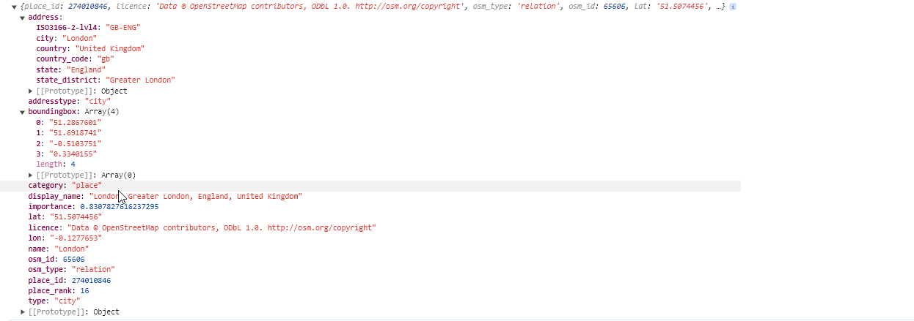
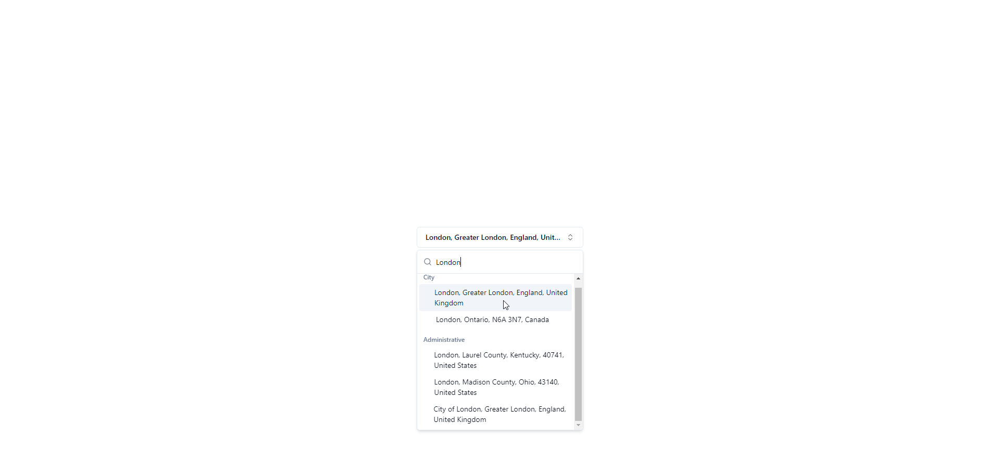

# SearchAddress Component

The `SearchAddress` component provides a flexible and interactive search interface for addresses, utilizing the powerful Nominatim service from OpenStreetMap. This component is built with React and integrates UI components from `shadcn-ui` and icons from `lucide-react`.

## Screenshots

<p align="center">
  
  
</p>

## Features

- **Autocomplete Search**: Offers suggestions as you type, reducing the need for full address inputs and improving user experience.
- **Grouped Results**: Displays search results grouped by address type, making it easier to find the exact location.
- **Interactive UI**: Uses a popover to display search results that can be selected via click or touch interaction.
- **Debounced Input**: Improves performance by debouncing the search input.
- **Multiple Providers Support**: Uses `leaflet-geosearch` to support multiple geocoding providers.

## Installation

### Dependencies

First, ensure that `shadcn-ui` components are added to your project. If not already installed, you can add them using the following command:

```bash
npx shadcn-ui@latest add button command popover
```

Additionally, install `lucide-react` for using icons:

```bash
npm install lucide-react
```

Or using yarn:

```bash
yarn add lucide-react
```

Next, install `leaflet-geosearch` for geocoding support:

```bash
npm install leaflet-geosearch
```

Or using yarn:

```bash
yarn add leaflet-geosearch
```

### Component File

Copy the component file into your project:

1. Download or copy the file `search-address.tsx` from the repository.
2. Place the file in your project directory, typically under `components/ui/`.

### Hook Files

Copy the hook files into your project:

1. Download or copy the files `use-debounce.ts` and `use-search-address.ts` from the repository.
2. Place the files in your project directory, typically under `hooks/`.

## Usage

1. **Import the Component**:

   Include the `SearchAddress` component in your React application by importing it:

   ```javascript
   import dynamic from "next/dynamic";

   const SearchAddress = dynamic(() => import("@/components/ui/search-address"), {
     ssr: false,
   });
   ```

   Using dynamic imports with SSR disabled helps avoid the `window is not defined` error during server-side rendering.

2. **Utilize the Component**:

   You can use the `SearchAddress` component anywhere within your React application:

   ```jsx
   function App() {
     return (
       <div className="App">
         <SearchAddress onSelectLocation={(location) => console.log(location)} />
       </div>
     );
   }
   ```

## Hooks

### `useDebounce`

This hook debounces a value, improving performance by limiting the number of times a function is called.

```typescript
import * as React from "react";

export function useDebounce<T>(value: T, delay?: number): T {
  const [debouncedValue, setDebouncedValue] = React.useState<T>(value);

  React.useEffect(() => {
    const timer = setTimeout(() => setDebouncedValue(value), delay ?? 500);

    return () => {
      clearTimeout(timer);
    };
  }, [value, delay]);

  return debouncedValue;
}
```

### `useSearchAddress`

This hook encapsulates the search logic and state management for the `SearchAddress` component.

```typescript
import { useState, useCallback, useEffect } from "react";
import { OpenStreetMapProvider } from "leaflet-geosearch";
import { RawResult } from "leaflet-geosearch/dist/providers/bingProvider.js";
import { SearchResult } from "leaflet-geosearch/dist/providers/provider.js";
import { useDebounce } from "./use-debounce";

interface UseSearchAddressResult {
  query: string;
  results: Record<string, SearchResult<RawResult>[]>;
  loading: boolean;
  handleSearch: (value: string) => void;
  selectedItem: SearchResult<RawResult> | null;
  setSelectedItem: (item: SearchResult<RawResult> | null) => void;
}

export const useSearchAddress = (): UseSearchAddressResult => {
  const [query, setQuery] = useState("");
  const [results, setResults] = useState<
    Record<string, SearchResult<RawResult>[]>
  >({});
  const [loading, setLoading] = useState(false);
  const [selectedItem, setSelectedItem] =
    useState<SearchResult<RawResult> | null>(null);

  const debouncedQuery = useDebounce(query, 500);

  const groupByType = useCallback(
    (data: SearchResult<RawResult>[]): Record<string, SearchResult<RawResult>[]> => {
      return data.reduce(
        (acc, item) => {
          const { raw } = item;

          const rawData = raw as unknown as any;
          const type = rawData.class;

          if (!acc[type]) {
            acc[type] = [];
          }
          acc[type]?.push(item);
          return acc;
        },
        {} as Record<string, SearchResult<RawResult>[]>
      );
    },
    []
  );

  const handleSearch = (value: string) => {
    setQuery(value);
  };

  useEffect(() => {
    const fetchResults = async () => {
      if (debouncedQuery.length > 2) {
        setLoading(true);
        const provider = new OpenStreetMapProvider();
        const results = await provider.search({ query: debouncedQuery });
        setResults(groupByType(results as unknown as SearchResult<RawResult>[]));
        setLoading(false);
      } else {
        setResults({});
      }
    };

    fetchResults();
  }, [debouncedQuery, groupByType]);

  return {
    query,
    results,
    loading,
    handleSearch,
    selectedItem,
    setSelectedItem,
  };
};
```

## Component Dependencies

This component relies on the following external libraries and styles:

- `shadcn-ui` for UI components such as Button, Command, and Popover.
- `lucide-react` for icons like `Check` and `ChevronsUpDown`.
- `leaflet-geosearch` for geocoding support with multiple providers.

## API Configuration

The component makes requests to the `https://nominatim.openstreetmap.org/search` endpoint. Ensure that any API usage complies with the [Nominatim usage policy](https://operations.osmfoundation.org/policies/nominatim/), particularly regarding the custom HTTP header requirements for identification.

For configuration options and details on supported providers, refer to the [leaflet-geosearch documentation](https://smeijer.github.io/leaflet-geosearch/).

## Contributing

Contributions to enhance or fix issues in the `SearchAddress` component are welcome. Please follow the standard pull request process for this repository.

## License

This component is available under the MIT License. See the LICENSE file in the repository for full license text.